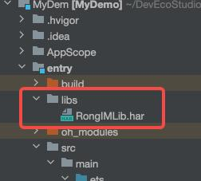
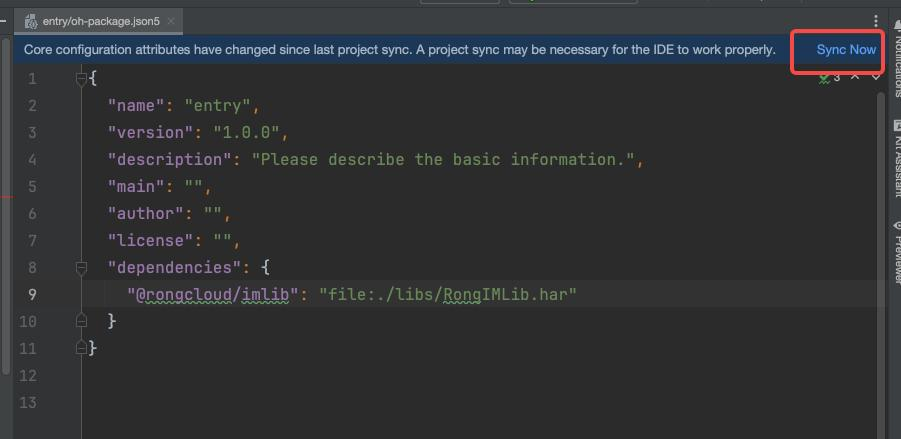

# 快速入门

本文介绍在鸿蒙平台下如何快速集成融云鸿蒙 IMLib 集成到项目中：

通过本文档您可以基本了解 鸿蒙 IMLib 的接入和使用

# 1. 环境要求
## 1.1. 编译环境

- DevEco Studio 版本号：DevEco Studio NEXT Developer Beta1 5.0.3.403
- 手机系统版本号：NEXT.0.0.26

## 1.2. 设备要求

- 真机：华为 Mate 系列。真机运行需要配置证书，详情参考鸿蒙的[签名指南]文档。
- 模拟器。详情参考鸿蒙的[模拟器运行指南]文档。

# 2. 注册融云和鸿蒙账号

## 2.1. 注册融云和鸿蒙
- [注册融云开发者账号](https://console.rongcloud.cn/agile/register)。注册成功后，控制台会默认自动创建您的首个应用，默认生成**开发**环境下的 App Key，使用国内数据中心。
- 获取开发环境的应用 [App Key](https://console.rongcloud.cn/agile/formwork/app/appService)

    :::tip

    每个应用具有两个不同的 App Key，分别对应**开发**环境与**生产**环境，两个环境之间数据隔离。在您的应用正式上线前，可切换到使用**生产**环境的 App Key，以便上线前进行测试和最终发布。
    :::
- [创建鸿蒙应用]

## 2.2. 获取融云 AppKey 和 token

进入 [融云管理后台](https://console.rongcloud.cn/agile/formwork/app/appService) 获取 AppKey 

北极星 > IM > Server API 调试 中获取 token


# 3. Demo 使用

1. DevEcho-Studio 打开 IMLibQuickDemo 
2. 将 AppKey 和 token 填写到 **entry/src/main/ets/pages/EnvDefine.ets**
3. 直接运行项目

quickdemo 中实现了 SDK 初始化，连接，连接状态监听，收发消息等基础功能，详细见 **entry/src/main/ets/pages/Index.ets**

# 4. 接入 SDK 流程

从融云官网获取鸿蒙 SDK 


**当前仅提供本地依赖方式，SDK 仅支持 arm64-v8a 架构（鸿蒙真机和模拟器均支持 arm64-v8a）。**


创建 **entry/libs** 文件夹，将 SDK har 包放入其中。

 

### 添加依赖 SDK

#### 命令行安装 SDK

在工程根路径下执行以下命令行：

```shell
ohpm install entry/libs/RongIMLib.har
```

执行完，在 **工程根路径下 的 oh-package.json5** 就会依赖 SDK。

```json
// 工程根路径下的 oh-package.json5
{
  "name": "mydemo",
  "version": "1.0.0",
  "description": "Please describe the basic information.",
  "main": "",
  "author": "",
  "license": "",
  "dependencies": {
    "@rongcloud/imlib": "file:entry/libs/RongIMLib.har" // 该配置由命令行生成
  },
  "devDependencies": {
    "@ohos/hypium": "1.0.16",
    "@ohos/hamock": "1.0.0"
  }
}
```

#### entry  配置文件依赖 SDK

在 **entry** 同级目录的 oh-package.json5 手动配置 SDK 依赖

```json
// entry 同级目录下的 oh-package.json5 需要手动配置
{
  "name": "mydemo",
  "version": "1.0.0",
  "description": "Please describe the basic information.",
  "main": "",
  "author": "",
  "license": "",
  "dependencies": {
    "@rongcloud/imlib": "file:./libs/RongIMLib.har"  // 该配置手动依赖
  },
  "devDependencies": {
    "@ohos/hypium": "1.0.16",
    "@ohos/hamock": "1.0.0"
  }
}
```

#### 同步项目

entry/oh-package.json5 中点击 **Sync Now** 同步工程。

  

同步之后就可以按照接口文档正常使用 SDK。

假如同步之后无法导入 SDK，原因可能是 DevEco-Studio 的编译缓存问题，尝试把 DevEco-Studio 完全关闭之后重新打开 APP 工程。


#### 添加 SDK 依赖权限

需要添加如下权限：

* ohos.permission.GET_NETWORK_INFO

* ohos.permission.INTERNET

* ohos.permission.STORE_PERSISTENT_DATA

详情请参考[鸿蒙应用权限配置]文档。 

# 5. 接口调用

[融云鸿蒙文档]已上线

更多的接口调用参考接口文档[API文档](./docs/API_Reference.md)

# 6. 问题反馈

如果您在使用过程中，有任何疑问都可以直接在融云官网进行咨询。


<!-- link -->
[签名指南]: https://developer.huawei.com/consumer/cn/doc/harmonyos-guides-V5/ide-signing-0000001587684945-V5
[模拟器运行指南]: https://developer.huawei.com/consumer/cn/doc/harmonyos-guides-V5/ide-run-emulator-0000001582636200-V5
[创建鸿蒙应用]: https://developer.huawei.com/consumer/cn/doc/app/agc-help-createapp-0000001146718717
[鸿蒙应用权限配置]: https://developer.huawei.com/consumer/cn/doc/harmonyos-guides-V5/3_2_u5e94_u7528_u6743_u9650_u7ba1_u63a7-V5
[融云鸿蒙文档]: https://docs.rongcloud.cn/harmonyOS-imlib